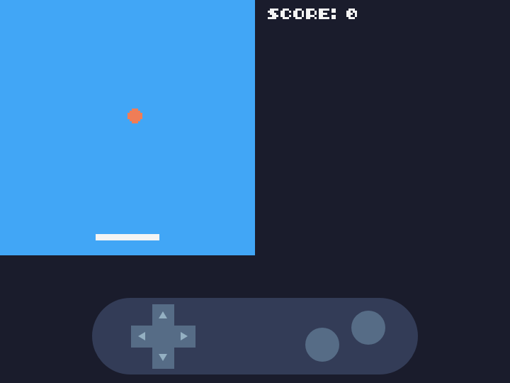

# Bienvenue dans l'atelier Pong

Tu vas créer ton propre jeu Pong avec **TIC-80**, une petite console rétro faite pour fabriquer des jeux.



Deux sujets te sont proposés :

| Sujet | Langage |
|---|---|
| **PyPong** | Python |
| **LuaPong** | Lua |

Les deux utilisent TIC-80 et mènent au même jeu, étape par étape. Seule la syntaxe change, c'est-à-dire la façon d'écrire le code.

La même instruction, dans les deux langages :

```python
if btn(2):
 padx = padx - 2
```

```lua
if btn(2) then
 padx = padx - 2
end
```

Choisis le sujet qui te tente. Tu pourras faire l'autre ensuite si tu en as envie.
